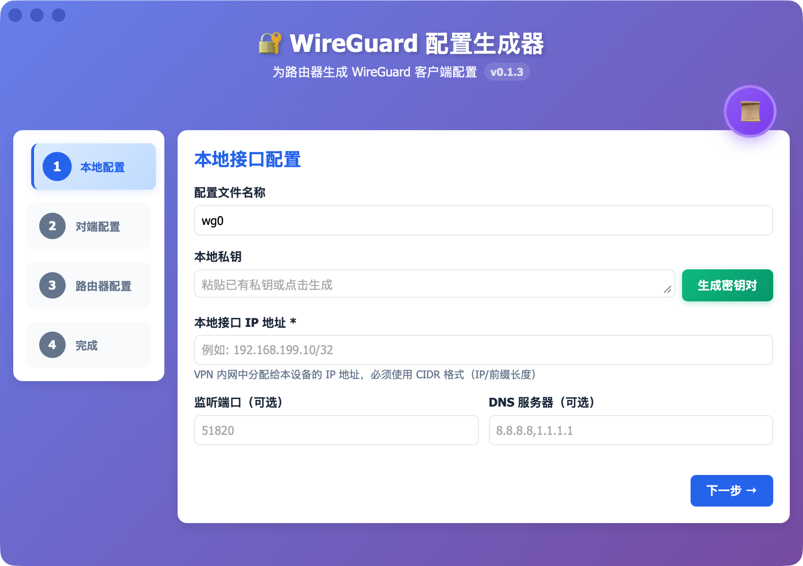

# 🔐 WireGuard 配置生成器

一个基于 Tauri 2 + React 19 构建的桌面应用程序，专为爱快（iKuai）路由器生成 WireGuard 客户端配置。



## ✨ 特性

- 📦 **跨平台桌面应用** - 基于 Tauri 2，支持 macOS、Windows、Linux
- 🔑 **密钥管理** - 一键生成 WireGuard 密钥对和预共享密钥（PSK）
- 📄 **配置生成** - 同时生成标准 WireGuard 配置和爱快路由器配置
- 📱 **二维码导入** - 自动生成配置二维码，支持移动设备快速导入
- 💾 **配置持久化** - 自动保存对端配置，下次无需重复输入
- 📜 **历史记录** - 保存所有生成的配置，支持查看、导出、删除
- 📦 **批量导出** - 支持导出单个配置或将所有配置打包为 ZIP
- 🎨 **友好界面** - 分步骤向导式操作，清晰直观

## 🛠️ 技术栈

- **前端**: React 19.1.0 + Vite 7.0.4
- **桌面框架**: Tauri 2
- **后端**: Rust (Tauri 后端)
- **包管理器**: Yarn

## 📦 安装

### 从源码构建

1. **克隆仓库**
```bash
git clone https://github.com/yourusername/wg-ikuai-client-gen.git
cd wg-ikuai-client-gen
```

2. **安装依赖**
```bash
yarn install
```

3. **开发模式运行**
```bash
yarn tauri dev
```

4. **构建应用**
```bash
yarn tauri build
```

构建产物位于 `src-tauri/target/release/bundle/`

## 🚀 使用指南

### 步骤 1: 本地接口配置

1. 输入配置文件名称（默认 `wg0`）
2. 生成或输入本地私钥
3. 输入本地接口 IP 地址（CIDR 格式，例如 `192.168.199.10/32`）
4. 可选：设置监听端口和 DNS 服务器

### 步骤 2: 对端配置（爱快服务器）

1. 输入爱快服务端公钥（从爱快管理界面获取）
2. 输入 Endpoint 地址（服务器公网 IP 或域名 + 端口）
3. 可选：生成预共享密钥（PSK）以增强安全性
4. 设置 AllowedIPs（`0.0.0.0/0` 为全局 VPN）
5. 设置 PersistentKeepalive（推荐 25 秒）

> 💡 此步骤的配置会自动保存，下次无需重复输入

### 步骤 3: 爱快 Peer 配置

1. Peer ID 会自动递增
2. 输入爱快接口名称（默认 `wg_0`）
3. 输入备注名称（例如：iPhone、MacBook）

### 步骤 4: 生成完成

- **WireGuard 配置文件** - 可保存为 `.conf` 文件或扫码导入
- **爱快 Peer 配置** - 可保存为 `.txt` 文件，在爱快路由器中导入

## 📁 项目结构

```
.
├── src/                    # React 前端代码
│   ├── App.jsx            # 主应用组件
│   ├── main.jsx           # React 入口文件
│   ├── ConfirmDialog.jsx  # 确认对话框组件
│   └── App.css            # 样式文件
├── src-tauri/             # Tauri Rust 后端
│   ├── src/
│   │   ├── lib.rs         # 主库文件，包含所有 Tauri 命令
│   │   └── main.rs        # 入口文件
│   ├── Cargo.toml         # Rust 依赖配置
│   ├── tauri.conf.json    # Tauri 配置文件
│   └── capabilities/      # Tauri 权限配置
├── screens/               # 截图资源
├── index.html             # HTML 入口
├── vite.config.js         # Vite 配置
└── package.json           # Node.js 依赖配置
```


## 🔧 开发命令

### 前端开发
```bash
# 启动 Vite 开发服务器（仅前端）
yarn dev

# 构建前端
yarn build

# 预览构建结果
yarn preview
```

### Tauri 开发
```bash
# 启动 Tauri 开发模式（包含热重载）
yarn tauri dev

# 构建 Tauri 应用
yarn tauri build
```

### Rust 后端开发
```bash
cd src-tauri

# 检查 Rust 代码
cargo check

# 运行 Rust 测试
cargo test

# 格式化 Rust 代码
cargo fmt

# 运行 Clippy 检查
cargo clippy
```

## 📝 功能说明

### 密钥生成

- **WireGuard 密钥对**：基于 X25519 算法生成私钥和公钥
- **预共享密钥（PSK）**：额外的安全层，推荐启用
- **自动公钥计算**：输入私钥时自动计算公钥

### 配置持久化

应用使用 Tauri 的应用数据目录存储配置：

- **macOS**: `~/Library/Application Support/com.wireguard.config-generator/`
- **Windows**: `%APPDATA%\com.wireguard.config-generator\`
- **Linux**: `~/.local/share/com.wireguard.config-generator/`

存储内容：
- `config.json` - 对端配置、爱快配置、Peer ID 计数器
- `history/` - 所有生成的历史配置记录

### 历史记录

- 自动保存每次生成的配置
- 支持查看、导出、删除单条记录
- 支持导出所有配置为 ZIP 压缩包
- 支持导出所有 Peer 配置为单个文本文件
- 支持清空所有数据（包括配置和历史记录）

### 配置格式

#### 标准 WireGuard 配置（.conf）
```ini
[Interface]
PrivateKey = xxx
Address = 192.168.199.10/32
ListenPort = 51820
DNS = 8.8.8.8

[Peer]
PublicKey = xxx
PresharedKey = xxx
Endpoint = example.com:51820
AllowedIPs = 0.0.0.0/0, ::/0
PersistentKeepalive = 25
```

#### 爱快 Peer 配置（.txt）
```
id=1 enabled=yes comment=iPhone interface=wg_0 peer_publickey=xxx presharedkey=xxx allowips=192.168.199.10/32 endpoint= endpoint_port= keepalive=25
```

## 🤝 贡献

欢迎提交 Issue 和 Pull Request！

## 📄 许可证

MIT License

## 🙏 致谢

- [WireGuard](https://www.wireguard.com/) - 现代 VPN 协议
- [Tauri](https://tauri.app/) - 轻量级桌面应用框架
- [React](https://react.dev/) - UI 框架
- [爱快路由器](https://www.ikuai8.com/) - 企业级路由系统

---

**WireGuard Client Config Generator for iKuai Router**
